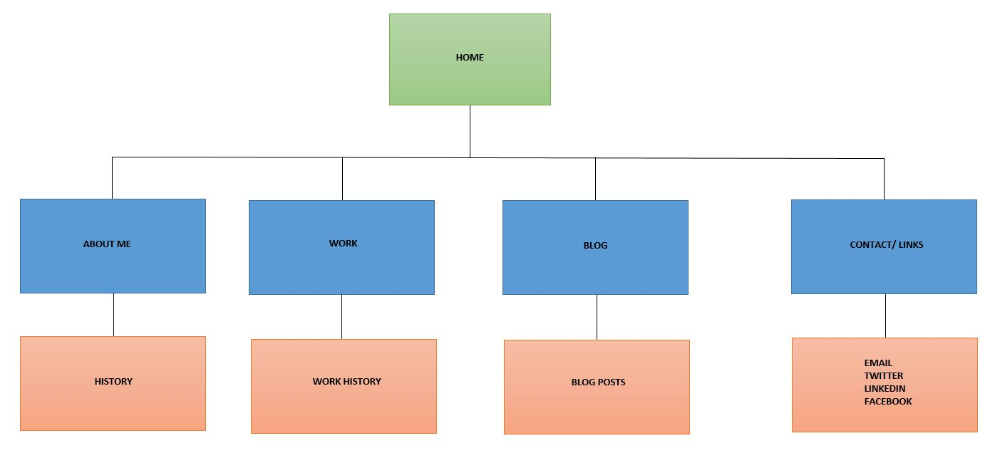

# Site Map and Design Reflection

What are the 6 Phases of Web Design?
   The six phases of web design are:
   1. Information Gathering - figuring out the purpose of the site, the goals, audience and content.
   2. Planning - create a site map to map out topic areas of the site.
   3. Design - take into account all the information and mock up and image of website.
   4. Development - have developers and designers work to implement the creation of the site.
   5. Testing and Delivery - test functionality and strive to meet web dev standards. Use FTP to load files to web server.
   6. Maintenance - continue to add new content, fix bugs and other issues throughout the life cycle.

What is your site's primary goal or purpose? What kind of content will your site feature?
   My sites primary goal and purpose is to have it market myself as a developer. It will have four main content areas:
   1. About Me - which will tell the reader about myself and what I do.
   2. Work - this area will showcase my projects that I have done at DBC and other side projects
   3. Blog - in this area I will showcase my weekly blog on what I have learned for that week and my reflection on my journey
   4. Contact Me - this area will have links to my GitHub, LinkedIn, Twitter, Facebook.

What is your target audience's interests and how do you see your site addressing them?
 - My target audience will be anyone but mainly recruiters. The site will address them by showcasing all of my work and history showing
   them how I have grown. The site design and development will also showcase what I am capable of as a devloper.

What is the primary "action" the user should take when coming to your site? Do you want them to search for information, contact you, or see your portfolio? It's ok to have several actions at once, or different actions for different kinds of visitors.
 - The action I want the user to take is a little bit of everything and in this order. First, I want the user to be fasicanted with the
   site design and flow. Next, I would like the user to view my portfolio or my about me page to get to know me further. Last, if interested, reach out to me via one of my contact methods.

What are the main things someone should know about design and user experience?
 - I think some of the misconceptions people may have about the design and user experience is that it is simply the layout of a website.
   It incorporates a lot more aspects such as psychology, utility, performance and more.  Design and UX is not static but dynamic and will constantly change as user behavior changes. Another part of design and UX is the data analytics from surveys, user usage of the site, and feedback.

What is user experience design and why is it valuable?
 - User experience design is a process of refining and improving the interaction between the user and product; in this case a website.
 - Its very important becuase your users are your audience. It is essential to make the user experience best as possible so that
   retention occurs. If the site is buggy, cluttered, filled with pop-ups etc.. chances are the user will not return.

Which parts of the challenge did you find tedious?
 - The parts of this challenge that felt tedious had to be the site map creation as after you have everything listed you have to create
   a series of boxes and bars to map everything. It probably was tedius because I used excel as the program is not designed for site mapping.
