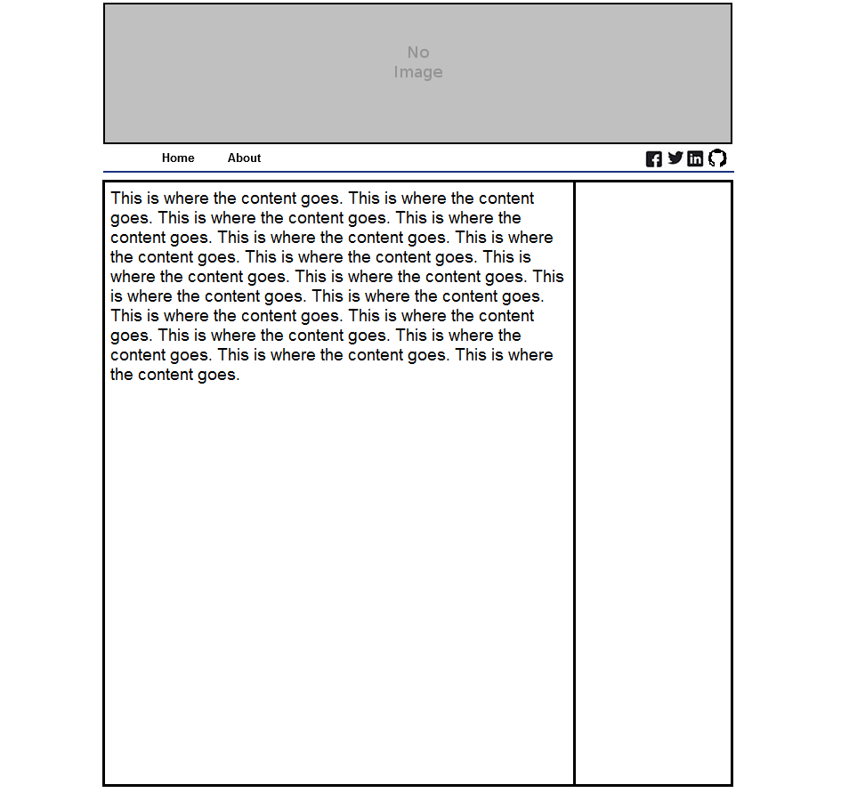
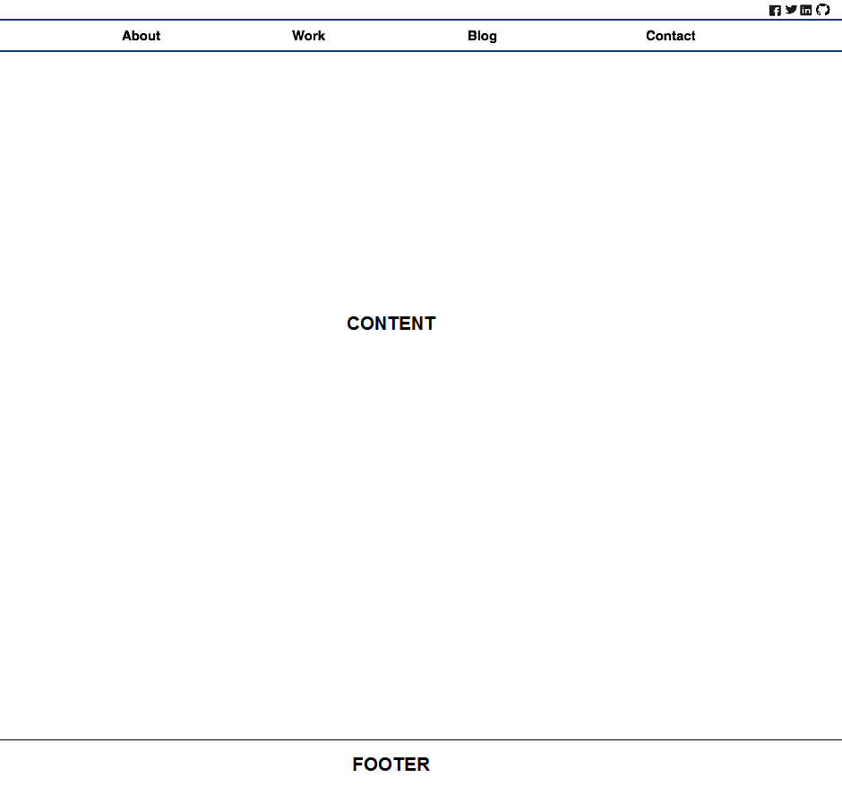

#2.4 Wireframing

**What is a wireframe?**
 - Wireframe is a basic blueprint of the website without any color or actual content pieces. It is a skeleton framework where the
   site's most important elements will be placed.

**What are the benefits of wireframing?**
 - There are plenty of benefits to wireframing. It allows a designer to worry about the arangements of the site that would be best for
   the user. It also only allows greyscale so that there is very little distraction from color. In my opinion though, one of the most
   beneficial reason for wireframing is to save time. If you went through a whole design and coding phase only in the end to find out you did not like the end product at all then you would be back to square one. At least with wireframing you can go through iterations and only keep what iterations you like.

**Did you enjoy wireframing your site?**
- Yes and no. I liked visually seeing the end product and then making tweaks and working from that point on. I found it much easier when
  you didn't have a blank canvas to work with; at least I found my mind to work better from that point.  I didn't like putting together
  the wireframes becuase I hit a road point with the programs I was using such as not being able to get the social media icons. So it was hard switching back and forth on two programs to put the wireframe together.

**Did you revise your wireframe or stick with your first idea?**
- Before I even started I went through some of my favorite blogs and websites and listing the best designs I liked about each. Then I
  started the nitty gritty process of creating a template on paper and revising it; fortuantely I knew I wanted a simple design so it
  didn't take many revisions.

**What questions did you ask during this challenge? What resources did you find to help you answer them?**
- I think the questions I had to ask myself during this challenge was what did I want to portray in my site's layout? What is the main
  convention on several of the sites that you visit? Oh and of course how the heck do you get the social media icons into the wireframe!?
  To answer these out I visited all of my favorite sites that I go on daily and thought about what did I like about their layout and what I did not. Another issue I had was to display the social media icons and the software didn't support this so like always I trusted on my good ole' MS Paint; saving me since Windows95!

**Which parts of the challenge did you enjoy and which parts did you find tedious?**
- There were a few parts that I enjoyed but the most satisfying was when it was all done and you get to reflect on you first wireframe
  ever; despite looking so simple! The part that was tedious had to have been the revisions and research. The research kind of got boring as it was mainly information scrapping; for example, xyz site I like this and this then on to the next site.

