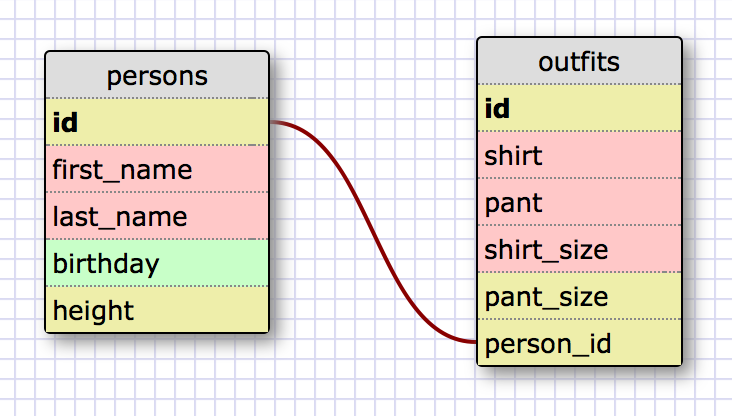

# Intro to Database Schemas and SQL

## Release 5 - SELECTing data from database
1. SELECT * FROM states;

2. SELECT * FROM regions;

3. SELECT state_name, population FROM states;

4. SELECT state_name, population
   FROM states
   ORDER BY population DESC;

5. SELECT state_name
   FROM states
   WHERE region_id = 7;

6. SELECT state_name, population_density
   FROM states
   WHERE population_density > 50
   ORDER BY population_density ASC;

7. SELECT state_name
   FROM states
   WHERE population BETWEEN 1000000 AND 1500000;

8. SELECT state_name, region_id
   FROM states
   ORDER BY region_id ASC;

9. SELECT region_name
   FROM regions
   WHERE region_name LIKE '%Central%';

10. SELECT region_name, state_name
    FROM states
    JOIN regions ON states.region_id = regions.id
    RDER BY region_id ASC;

## Release 6 - My Own Schema

## Release 7 - Reflection

What are databases for?
- Databases are used to efficiently store, organize, and access vast amoounts of information. You can store
  all types of data in each table.

What is a one-to-many relationship?
- One to many relation is where one field in a table can be related to many other fields in a related table.
  For example, when comparing a home address to a person, a person can have many homes but an address can have
  one person/owner.

What is a primary key? What is a foreign key? How can you determine which is which?
- A primary key is a primary keyword that is unique to each record in the table. You can tell that a key is
  primary because you will not find any duplicates of that record.
  A foreign key is column that references a column of another table; hence foreign. The reason is for reference
  purposes. You can usually tell a key is foreign by the field name as it will usually reference another table's
  field.

How can you select information out of a SQL database? What are some general guidelines for that?
- To select information from SQL DB you use keywords to query the database; SELECT is a must keyword for this.
  An easly guidline is that just like any programming language you need to follow the required syntax in order for
  your query to parse.
