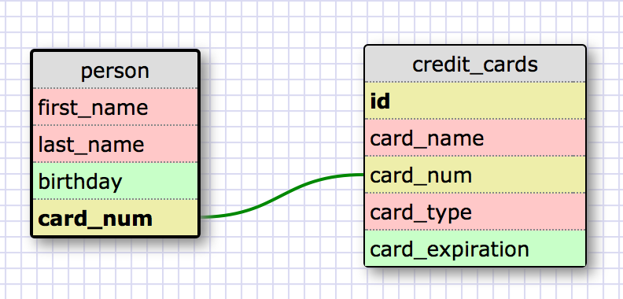

## 8.5 More Schemas

### Release 2 - One to One Relationship

This schema represents a one to one relationship because a credit card number can only be associated with one
person. If the person doesn't have a credit card then this field is NULL.

### Release 4 - Many to Many Relationships

### Release 6 - Reflection

What is a one-to-one database?
- A one to one databse is where two tables have a relationship but only one row between them is matched.
  For example, a child can have one father and one mother only no more no less.

When would you use a one-to-one database? (Think generally, not in terms of the example you created).
- I guess when you get your driver's license that would be a one to one relationship in the DMV database.
  So in the database you can have on the license_number and that number can only be linked to one person.

What is a many-to-many database?
- A many to many database is when two tables contain records in which multiple records can correspond to multiple
  records in the other table and vice versa.

When would you use a many-to-many database? (Think generally, not in terms of the example you created).
- One scenario would be for stocks at a brokerage firm. A company has many investors, investors might invest in many
  companies. The database would have information to link a stock with its investors and investors link to many differnt
  stocks. Hopefully, I wansn't confusing.

What is confusing about database schemas? What makes sense?
- For me the confusing part is determining how to create the table and what fields go into each table; mainly the naming
  of the table and fields. It will also take some time getting used to analyzing what types of relationship each table can
  be. The part I do get is the primary and foreign keys also the querying and getting the data out makes sense to me it
  is just the design and building part that is difficult.

